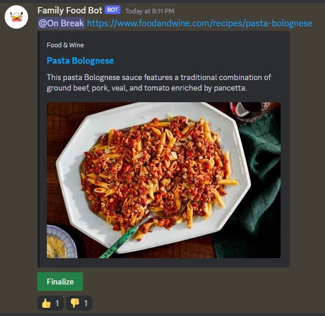

# Installation
The Food Organizer Bot is a Discord bot that helps families vote on what to eat during the week absed on family suggestions. The bot is written in Python and uses the Discord.py library.

## Getting Started
To use the Family Organizer Bot, you will need to have Python 3.6 or higher installed on your machine. You willa lso need to create a Discord bot and obtain its token. Instructions for creating a bot and obtaining its token can be found in the [Discord Documentation](https://discord.com/developers/docs/intro).

Once you have Python and the bot token set up, you can clone the repository and install necessary dependencies by running the following commands:

```bash
git clone https://github.com/yourusername/family-food-bot.git
cd Food_organizer_bot
pip install -r requirements.txt
```

Before running the bot, you will need to configure it by editing the `config.py` file. This file contains options for setting the prefix used by the bot, the channel where the bot will operate, the reactions used for boting, and the bot token.

## Usage
To start the bot, run the following command within the cloned directory:

```bash
python main.py
```

Once the bot is running, suggestions sent within the **suggestions_channel** will be automatically fitted with:
 *  Reactions from the `config.py` configuration
 * Finalize button - While clicked, the button will send the selected item to meals for the week.

## License
This project is licensed under the MIT License - see the [LICENSE](https://raw.githubusercontent.com/possiblyHugo/Food_organizer_bot/master/LICENSE) file for more details

## Example



## Acknowledgements
 * Thanks to the developers of the Discord.py library for making it easy to build Discord bots in Python.
 * Thanks to the Python community for creating such a great programming language.